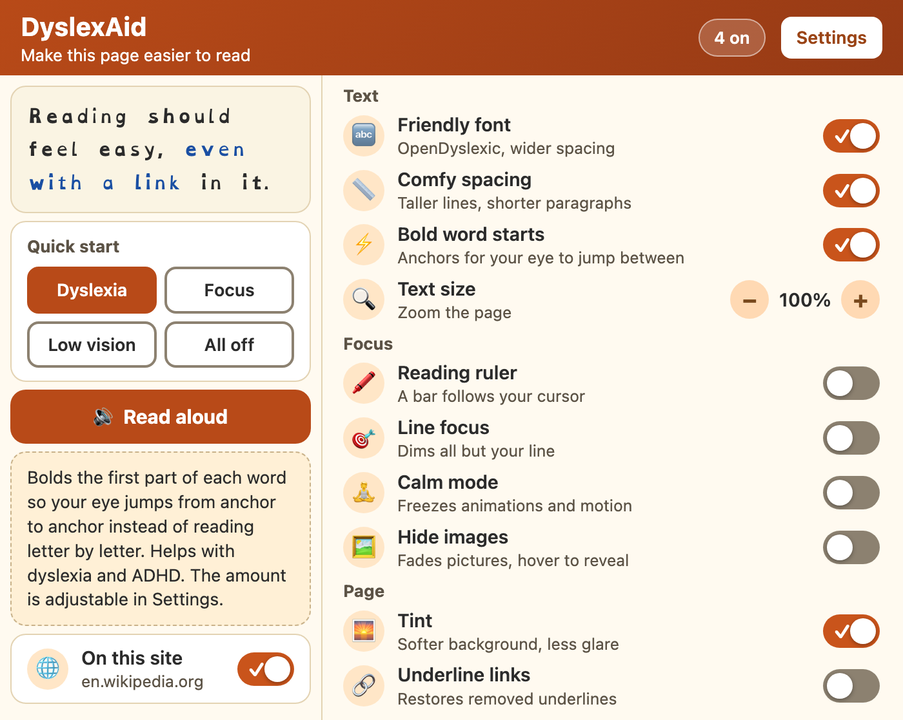
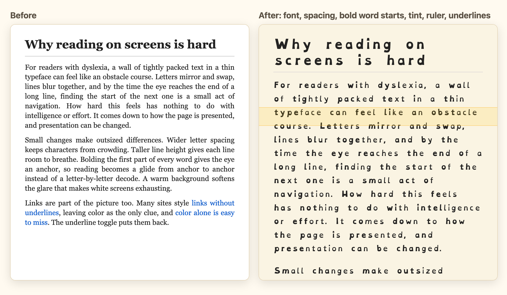

# DyslexAid: Reading Assistant

A free Chrome extension that makes any web page easier to read for people
with dyslexia, ADHD, low vision, or motion sensitivity. One click gives you
a dyslexia-friendly font, bold word starts, a reading ruler, a calmer page,
or a voice that reads the page to you. It collects nothing and never connects
to the internet.

Website: https://prathammukewar.github.io/dyslexaid/



## Features

| Feature | What it does |
|---|---|
| **Friendly font** | Swaps in [OpenDyslexic](https://opendyslexic.org), whose weighted letter-bottoms resist flipping, and widens letter and word spacing |
| **Comfy spacing** | Raises line height, adds paragraph breathing room, left-aligns text, and caps line length around 70 characters |
| **Bold word starts** | Bolds the first part of every word (30, 40, or 50%) so the eye anchors and glides, a technique sometimes sold as bionic reading. Works on infinite-scroll feeds too |
| **Reading ruler** | A soft highlight band follows your cursor, or moves with Alt+Up and Alt+Down, so you never lose your line |
| **Line focus** | Dims the whole page except a band around your line |
| **Calm mode** | Freezes animations, transitions, and motion on the page |
| **Hide images** | Fades pictures and embeds so text stands alone; hover brings one back |
| **Tint** | A cream, blue, yellow, or green overlay that cuts white-screen glare. Dark pages are left alone |
| **Underline links** | Restores underlines on sites that stripped them |
| **Read aloud** | Speaks your selection, or the whole article, using the voice built into your browser |
| **Text size** | Zooms the whole page from 100% to 160% |
| **Per-site pause** | Turns everything off for one site without losing your settings |

Keyboard shortcuts: **Alt+Shift+R** toggles the ruler, **Alt+Shift+B**
toggles bold word starts, and **Alt+Shift+S** starts or stops read aloud. All
three can be changed at `chrome://extensions/shortcuts`.



## Built for people who do not want to read a manual

The first time it installs, a welcome page opens with four presets
(Dyslexia, Focus, Low vision, Nothing yet). Pick one and the page you are
looking at changes, so you see the effect before you open anything else.

The popup works the same way. The presets are at the top, a preview
sentence changes as you flip switches, and hovering over or tabbing to
anything shows a plain explanation of what it does and who it tends to
help. A badge counts how many features are on. The Settings page has the
finer knobs: bionic boldness, tint color, ruler height, read-aloud speed,
paused sites, and links for reporting problems.

Settings are saved with `chrome.storage.sync`, so they persist across pages,
restarts, and your other Chrome installs.

## Install

Until the Chrome Web Store listing is live:

1. Download the latest zip from the
   [releases page](https://github.com/prathammukewar/dyslexaid/releases/latest)
   and unzip it, or clone this repository
2. Open `chrome://extensions` and turn on **Developer mode** (top right)
3. Click **Load unpacked** and select the folder
4. The welcome page opens; pick a preset. Pin "DyslexAid" from the
   puzzle-piece menu so the popup is one click away

There is a sample article at [demo/demo.html](demo/demo.html) with an
animated badge, an image, and underline-less links, so every toggle has
something to act on (enable "Allow access to file URLs" on the extension
card, or just use any Wikipedia article).

## How it works

Settings live in one place: `chrome.storage.sync`. The popup, the welcome
page, the settings page, and the keyboard-shortcut service worker only
write to it, and the content script in every open tab listens for changes
with `chrome.storage.onChanged` and applies them. There is no custom
message routing, and every tab stays in sync, including tabs that were
already open.

Each visual feature is a CSS attribute toggle. The content script flips an
attribute on `<html>` (for example `data-dyslexaid-font="on"`) and the
stylesheet rules keyed to that attribute do the actual restyling, so turning a
feature on or off costs a single DOM write.

Bold word starts is the one feature that rewrites the page. A `TreeWalker`
visits only text nodes, skips code blocks, form fields, and editable regions,
and wraps the start of each word in `<b class="dyslexaid-bionic">`. A
debounced `MutationObserver` catches content added after page load, which is
what makes the feature work on infinite-scroll feeds and comment sections.
When you toggle it off, the wrappers stay in the DOM and CSS renders them at
normal weight, so turning it back on is instant. Changing the boldness
unwraps and rewraps them.

Read aloud uses the browser's built-in speech synthesis, so the audio is
generated on your machine and no text goes anywhere. It is also the one
place the extension uses a message instead of a setting. Reading aloud
happens once and is over, so there is nothing to store; the popup or the
shortcut sends `{type: "speak"}` to the active tab and the content script
speaks or stops. While speech runs, a large button sits in the corner of the
page so you can see it is on and stop it with a click.

The ruler and line focus share one vertical position. The mouse moves it,
and so do Alt+Up and Alt+Down, with the step size tied to the ruler height,
so people who scroll with the keyboard can place the band without reaching
for a mouse.

The popup and settings page were built for the same readers as the
features. Every text and control color was measured against WCAG AA
(4.5:1 for text, 3:1 for controls), the toggles show a check mark so on and
off are not told apart by color alone, everything works by keyboard with
visible focus rings, the help panel is a live region so screen readers hear
it, switch animations turn off when your system asks for reduced motion,
and if you turn on the friendly font, the settings and welcome pages use it
too. The popup itself stays in the system font, because OpenDyslexic's wide
letters would push it past Chrome's 600px popup limit and force scrolling;
the preview card is where you see the font instead.

A few smaller details: the tint measures the page's background luminance
and leaves dark-themed pages alone, since a pale wash over near-black just
looks muddy; and the extension asks for only three permissions (`storage`,
`activeTab`, and `scripting`).

## Known limits

Read aloud has no per-word highlighting yet. Sites that build their own
text rendering (Google Docs, some PDF viewers) are outside what a stylesheet
can reach.

## Privacy

DyslexAid collects nothing. It has no analytics and makes no network
requests; your settings are stored in Chrome's own sync storage and never
leave your browser. The full policy is in [PRIVACY.md](PRIVACY.md).

## Structure

```
dyslexaid/
├── manifest.json        # Manifest V3 config, keyboard commands
├── background.js        # Service worker: shortcuts, welcome page on install
├── popup/               # Toolbar popup: presets, preview, help panel
├── options/             # Settings page
├── welcome/             # First-run page with presets and a live sample
├── content/
│   ├── content.js       # Applies settings; word-start bolding; ruler; read aloud
│   └── content.css      # All feature styles, attribute-keyed
├── fonts/               # OpenDyslexic (SIL OFL)
├── icons/
├── docs/                # Website (GitHub Pages) and screenshots
├── store/               # Chrome Web Store images
├── tools/gen_assets.py  # Renders every screenshot with headless Chrome
└── demo/demo.html       # A page to try every feature on
```

## Credits

Bundles the [OpenDyslexic](https://github.com/antijingoist/opendyslexic)
typeface by Abbie Gonzalez, used under the SIL Open Font License
([fonts/OFL.txt](fonts/OFL.txt)).

## License

[MIT](LICENSE) for the extension code. The bundled font keeps its own SIL OFL
license.
